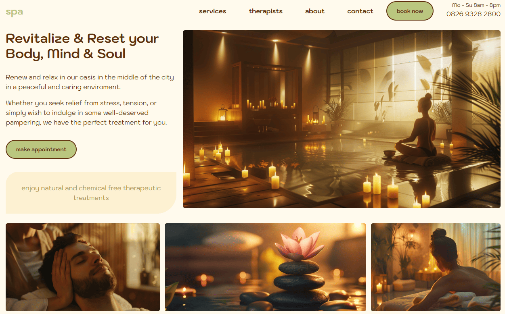
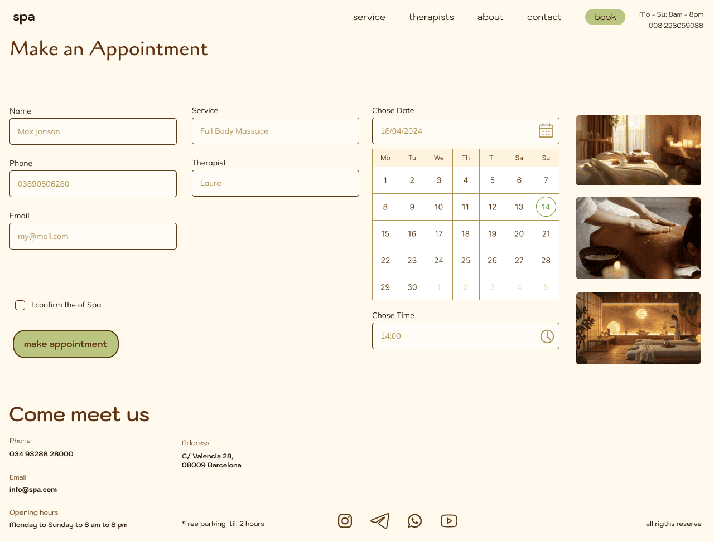
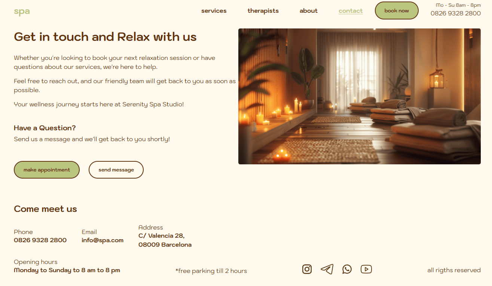

# Spa Studio Website

Spa Studio is a modern, **responsive** website built with **React**, **TypeScript**, and **SCSS**, offering a sleek and user-friendly experience. 

The design is fully responsive, ensuring seamless navigation across devices, and the prototype was crafted using Figma for a refined and intuitive layout. 

Perfect for showcasing spa services and enhancing user engagement.

### Previews

part of home page

booking page

contact page

 

<a href="https://artistfolio.onrender.com/" style="color:#BAC67F; font-size:18px">
live demo
</a>
